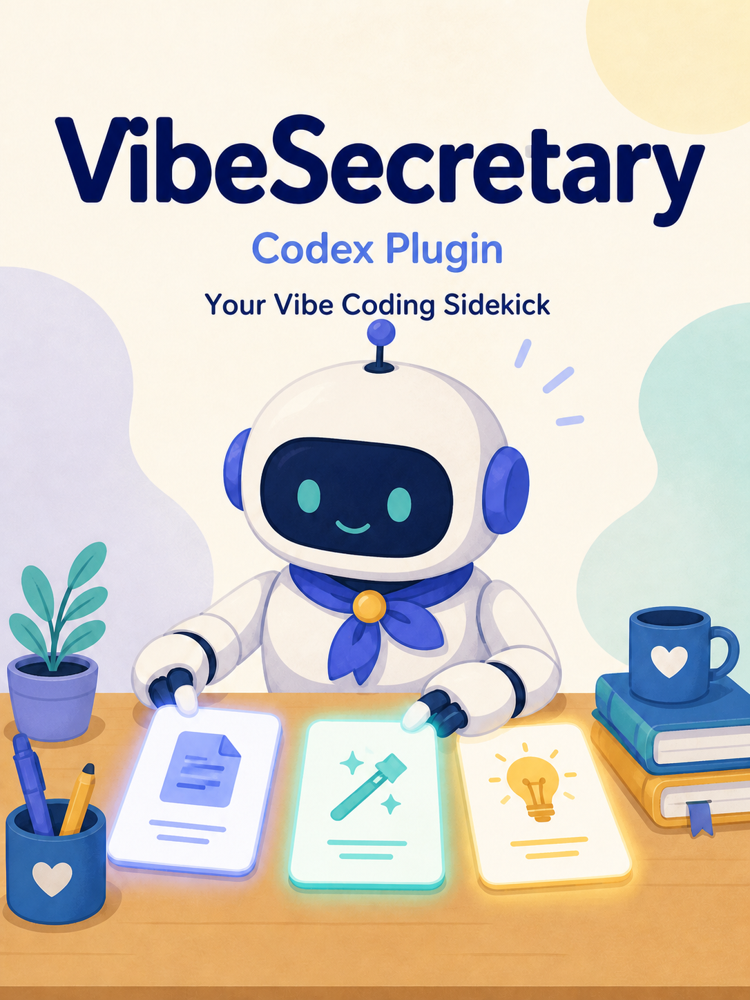
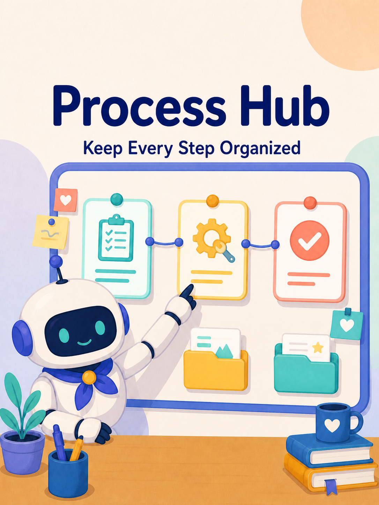
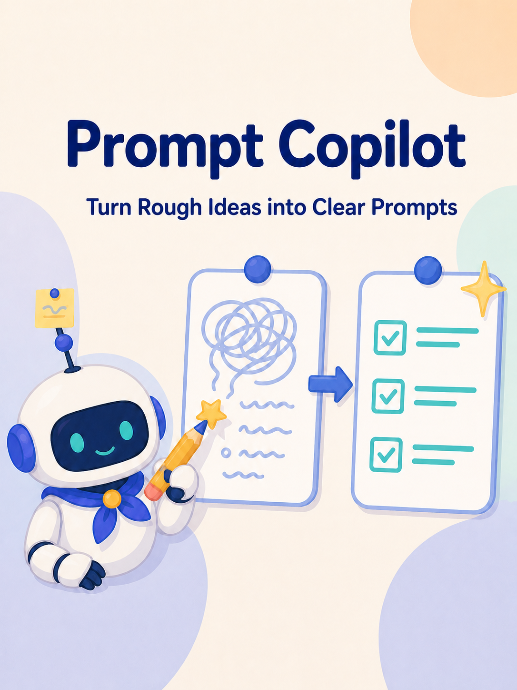
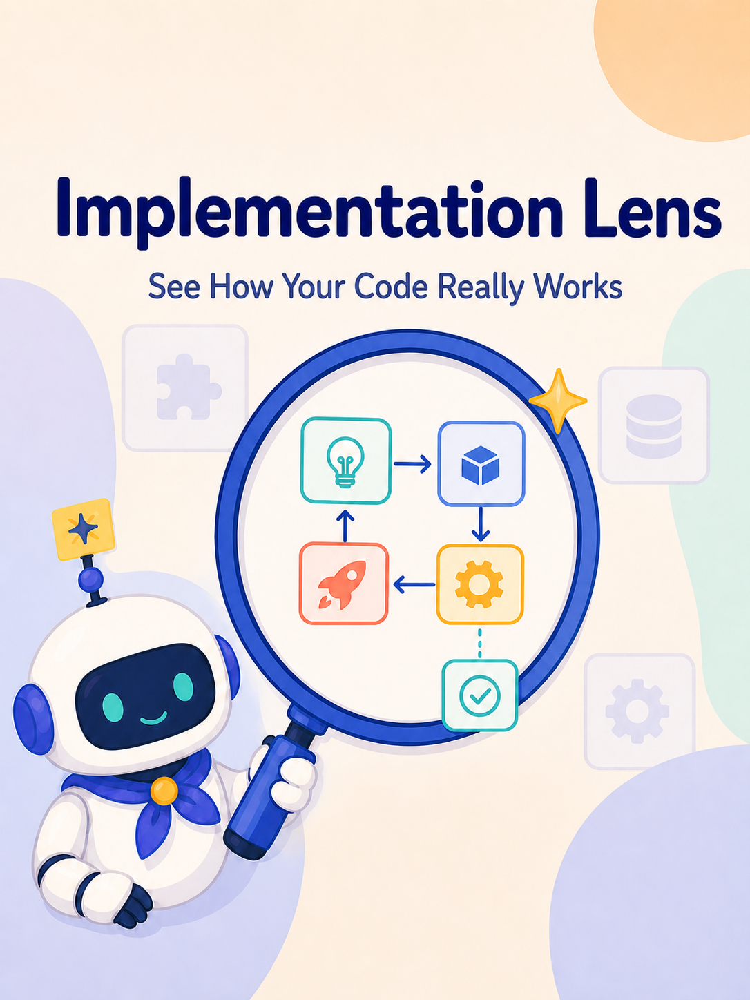

# VibeSecretary

[English](README.md) | [简体中文](README_zh.md)

VibeSecretary is a local Codex plugin for structured vibe coding. It helps developers preserve project context, manage development records, understand real implementation flows, and turn rough requests into clearer tasks without adding a separate desktop app or product CLI.

<p align="center">
  
</p>

## Three core features

### Process Hub

<p align="center">
  
</p>

Process Hub stores plans, build histories, ADRs, research notes, reviews, and custom process records as repository-native Markdown. Users define collection purpose and paths in TOML; documents remain Git-friendly, searchable, relatable, and indexable.

### Prompt Copilot

<p align="center">
  
</p>

Prompt Copilot enriches development requests with confirmed project evidence, missing constraints, acceptance criteria, and verification guidance. It supports automatic Quick, Review, and Strict workflows, plus leading `@pc` and `@npc` controls for one message.

### Implementation Lens

<p align="center">
  
</p>

Implementation Lens uses read-only Python static analysis to build a reusable, evidence-linked project model and a minimum-sufficient explanation for the current question. A leading `@lens` produces paired Markdown and static-first offline HTML while favoring clarity and truth over graph completeness.

## Local installation

The current development workflow uses Windows PowerShell, Python 3.12, and Codex CLI.

### 1. Prepare the runtime

Run from the cloned repository root:

```powershell
py -m venv .venv
.\.venv\Scripts\Activate.ps1
python -m pip install -r requirements-dev.txt
python -m pip install --no-deps -e plugins\vibe-secretary
python plugins\vibe-secretary\scripts\configure_local_runtime.py
```

The final command creates the runtime descriptor used by the Windows Hooks and points MCP at the repository-local `.venv`. Repeat it after moving the repository or rebuilding `.venv`.

### 2. Install the plugin

```powershell
$vibeSecretaryRoot = (Resolve-Path .).Path
codex plugin marketplace add $vibeSecretaryRoot
codex plugin add vibe-secretary@personal
codex plugin list --json
```

The marketplace command is needed only the first time. Confirm that `vibe-secretary@personal` is installed and enabled. Plugin contributions are loaded when a new Codex thread starts.

### 3. Trust Hooks and initialize Foundation

Start Codex normally inside the consumer project:

```powershell
Set-Location D:\path\to\consumer-project
codex
```

Run `/hooks`, review and trust the VibeSecretary Hooks, then restart Codex once. Initialize the project without enabling it:

```text
Use $vibe-secretary-foundation to initialize VibeSecretary for this project. Do not enable it yet.
```

Review `.vibesecretary/config.toml` and `.vibesecretaryignore`. The default scope excludes common sensitive or irrelevant paths:

```gitignore
.git/
.venv/
.env
refs/
.vibesecretary/cache/
.vibesecretary/logs/
__pycache__/
*.py[cod]
```

Then confirm the scope and enable Foundation:

```text
I reviewed .vibesecretaryignore. Enable VibeSecretary Foundation for this project and confirm this scope.
```

The generated Foundation configuration starts disabled and keeps each feature independently disabled:

```toml
schema_version = 1
enabled = false
scope_file = ".vibesecretaryignore"

[provider]
mode = "codex_host"
name = ""
api_key_env = ""

[modules.process_hub]
enabled = false
config_file = "process-hub.toml"

[modules.implementation_lens]
enabled = false
config_file = "implementation-lens.toml"

[modules.prompt_copilot]
enabled = false
config_file = "prompt-copilot.toml"
```

Do not hand-edit generated `scope_digest` or module `config_digest` values. Editing a confirmed scope or feature TOML invalidates only that confirmation until the user reviews and confirms it again.

Copy and adapt the provided [consumer-project AGENTS.md template](plugins/vibe-secretary/docs/agent/AGENTS.md) when project instructions should tell Codex when to use each feature.

## Configure and start the features

Each feature follows the same safe lifecycle: initialize it, edit its TOML, explicitly confirm it, then use it. Enable only the features the project needs. The examples use explicit `$skill` names for unambiguous setup; daily work normally does not require naming a Skill every time. After the provided AGENTS.md template is adapted, Process Hub can follow project instructions and collection `usage`, Prompt Copilot can run through its automatic Hook, and Implementation Lens needs only a leading `@lens`.

### Process Hub

Initialize without enabling:

```text
Use $vibe-secretary-process-hub to initialize Process Hub for this project. Do not enable it yet.
```

Review `.vibesecretary/process-hub.toml`. The default schema 2 configuration is:

```toml
schema_version = 2

[[collections]]
id = "plans"
usage = "Create before major work to record goals, scope, design choices, and acceptance criteria; maintain it as implementation facts change."
path = "plans"
path_template = "{year}-{month}-{day}/{id}_{slug}.md"

[[collections]]
id = "build_hist"
usage = "Create after implementation and verification to record actual changes, checks, and remaining work; relate it to the source plan when one exists."
path = "build_hist"
path_template = "{year}-{month}-{day}/{id}_{slug}.md"
```

Users can change `path` and `path_template`, or add collections such as ADRs. Confirm and start using it:

```text
I reviewed .vibesecretary/process-hub.toml. Enable Process Hub for this project.
Use $vibe-secretary-process-hub to create a plan for replacing the authentication cache, including scope, risks, acceptance criteria, and verification.
```

See [Process Hub documentation](plugins/vibe-secretary/docs/process-hub.md) for custom collections, templates, lifecycle operations, and more examples.

### Prompt Copilot

Initialize without enabling:

```text
Use $vibe-secretary-prompt-copilot to initialize Prompt Copilot for this project. Do not enable it yet.
```

Review `.vibesecretary/prompt-copilot.toml`. The most important settings are:

```toml
schema_version = 2
default_mode = "review"       # quick, review, or strict
automatic_enabled = true      # false means opt-in through @pc or the explicit Skill
context_char_budget = 6000
hook_context_char_budget = 2400
per_source_char_budget = 1000
max_sources = 8
max_scan_files = 500
max_file_bytes = 262144
max_prompt_chars = 16000
```

Confirm, then send an ordinary development request or use a one-message control:

```text
I reviewed .vibesecretary/prompt-copilot.toml. Enable Prompt Copilot for this project.
Replace the authentication cache without changing public API behavior, and add regression tests.
@pc Review and strengthen this task before executing it: replace the authentication cache.
@npc Apply the already-approved typo fix without Prompt Copilot.
```

See [Prompt Copilot documentation](plugins/vibe-secretary/docs/prompt-copilot.md) for exact mode behavior, routing precedence, evidence sources, and privacy boundaries.

### Implementation Lens

Initialize without enabling:

```text
Use $vibe-secretary-implementation-lens to initialize Implementation Lens for this project. Do not enable it yet.
```

Review `.vibesecretary/implementation-lens.toml`. Its default schema 2 layout is:

```toml
schema_version = 2
default_granularity = "symbol"
index_json = ".vibesecretary/implementation-lens-index.json"

[output]
path = "ImplementationLens"
path_template = "reports/{granularity}/{slug}_{timestamp}.{ext}"
project_model_path = "_project_model"

[limits]
max_files = 2000
max_file_bytes = 1048576
max_nodes = 500
max_edges = 1000
max_audit_files = 5000
```

Users can edit the output root, report template, and reusable-model subdirectory. Confirm and start an analysis with a leading `@lens`:

```text
I reviewed .vibesecretary/implementation-lens.toml. Enable Implementation Lens for this project.
@lens Explain how this agent plans, calls tools, observes results, and stops. Use module granularity.
```

Use `module` for responsibilities and concept flow, `symbol` for the necessary symbol path, and `detail` for evidence-level calls and branches. These are cognitive levels, not fixed step counts. See [Implementation Lens documentation](plugins/vibe-secretary/docs/implementation-lens.md) for reusable-model behavior, custom paths, static-analysis limits, and report semantics.

## Daily Codex usage

Start normally with installed plugins:

```powershell
Set-Location D:\path\to\consumer-project
codex
```

No VibeSecretary environment activation or per-project plugin installation is required. To start one Codex process without any installed plugins:

```powershell
codex --disable plugins
```

`--disable plugins` affects all plugins for that process and does not change global installation state. Disabling VibeSecretary Foundation inside a project deactivates its project features but does not unload plugin Skills or Hooks from an already running thread.

### Sandbox and approvals

The recommended everyday command is simply `codex`. VibeSecretary does not require unrestricted filesystem access.

For a trusted local project where broader Codex permissions are intentional, the complete commands are:

```powershell
# Load VibeSecretary and other installed plugins with unrestricted filesystem access.
codex --sandbox danger-full-access --ask-for-approval on-request

# Use the same broad Codex permissions without loading any plugins.
codex --sandbox danger-full-access --ask-for-approval on-request --disable plugins
```

These commands are optional and materially reduce filesystem isolation. `.vibesecretaryignore` constrains VibeSecretary's own reads and explicit-path guards; it cannot reliably constrain opaque shell commands, Codex native tools in every form, or the operating system. Use the Codex sandbox and managed permissions when stronger enforcement is required.

## Update, disable, or remove

After pulling a newer checkout, activate `.venv`, refresh dependencies and the runtime descriptor, reinstall the current marketplace version, and start a new thread:

```powershell
.\.venv\Scripts\Activate.ps1
python -m pip install -r requirements-dev.txt
python -m pip install --no-deps -e plugins\vibe-secretary
python plugins\vibe-secretary\scripts\configure_local_runtime.py
codex plugin add vibe-secretary@personal
```

Ask `$vibe-secretary-foundation` to disable VibeSecretary only for the current consumer project. To uninstall the plugin and optionally remove the local marketplace:

```powershell
codex plugin remove vibe-secretary@personal
codex plugin marketplace remove personal
```

Remove the marketplace only when nothing else depends on it. Generated project records and reports remain ordinary project files and are not deleted by uninstalling the plugin.

## Documentation

- [Process Hub](plugins/vibe-secretary/docs/process-hub.md) · [简体中文](plugins/vibe-secretary/docs/process-hub_zh.md)
- [Prompt Copilot](plugins/vibe-secretary/docs/prompt-copilot.md) · [简体中文](plugins/vibe-secretary/docs/prompt-copilot_zh.md)
- [Implementation Lens](plugins/vibe-secretary/docs/implementation-lens.md) · [简体中文](plugins/vibe-secretary/docs/implementation-lens_zh.md)
- [Consumer-project AGENTS.md template](plugins/vibe-secretary/docs/agent/AGENTS.md)

## Development verification

Run from the repository root with `.venv` active:

```powershell
$env:PYTHONPATH = (Resolve-Path 'plugins\vibe-secretary\src').Path
python -m pytest plugins\vibe-secretary\tests -q
```